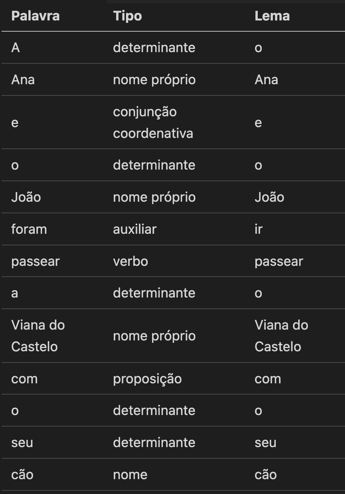

# Script para analisar tipos de palavras de textos

## Autor
Francisca Quintas Monteiro de Barros

## UC
SPLN

## Resumo

Script que, usando o `Spacy`, devolve informação sobre o conteúdo de uma frase - o seu lemma, o tipo de palavra (*Part of Speech*) e o seu valor.

Optei por ter o output no formato de tabela em *Markdown*, para ser mais fácil de visualizar.

## Exemplo de output



## Execução

Para poder executar esta script, primeiramente é necessário correr os seugintes comandos:
```bash 

pip install -U spacy
python -m spacy download pt_core_news_lg

```


Finalmente, apenas é necessário correr o comando:
```bash
python3 parseTexto.py > resultado.md
```